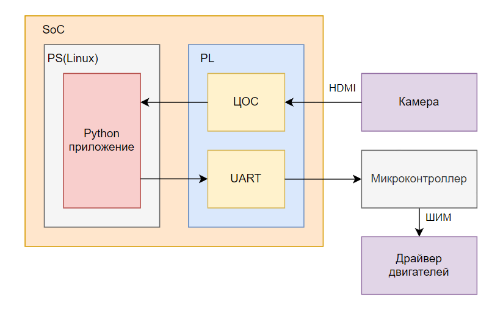
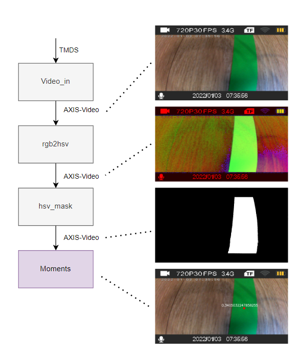
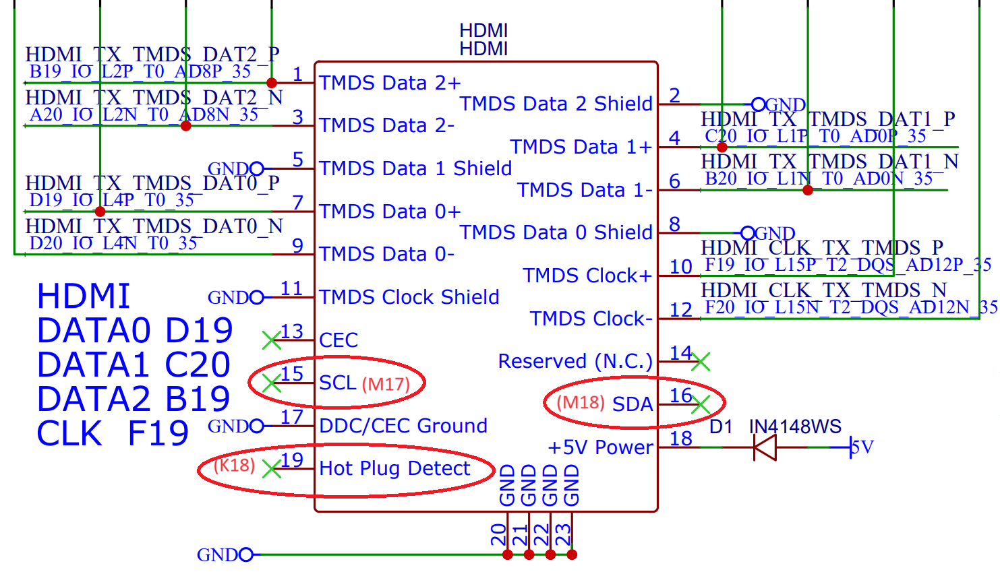
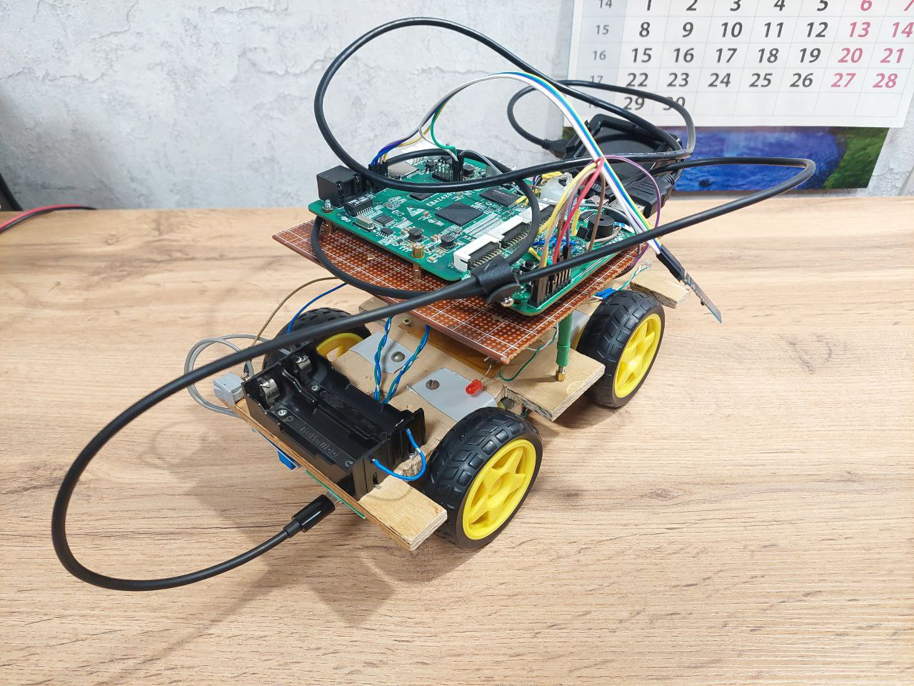
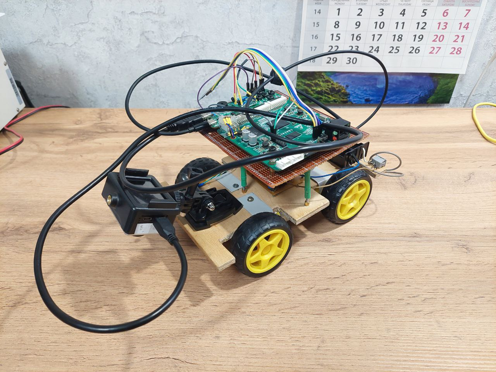

# PYNQ line forward car

Проект на базе PYNQ для движения робота по линии. Вся предварительная обработка изображения вынесена в FPGA.

### Схема платформы:

### Конвейер обработки в FPGA:
В истории коммитов можно проследить поэтапное добавление блоков из Python в FPGA:
- [Считывание картинки](https://github.com/alexmangushev/PYNQ_car/tree/f80f7b43f4eb89ce8aa254318c0908142aa2e2ac)
- [Сжатие изображения](https://github.com/alexmangushev/PYNQ_car/tree/e930900fad3a0c683328cc82cf4f1b7e8a10a8a2)
- [Преобразование RGB в HSV](https://github.com/alexmangushev/PYNQ_car/tree/205b518e1f1c33c4e81b5fdbadbc840d7ae69da0)
- [Выделение цвета](https://github.com/alexmangushev/PYNQ_car/tree/baea69e300628412fd7cb3017b0deb7f23b24872)
- [Подсчет моментов](https://github.com/alexmangushev/PYNQ_car/tree/7584a5e1d83812ce4af53bdb49095f0354ac9473)

### Модификация пдключения по HDMI
Используется стандартная плата расширения для EBAZ4205 с подпайкой проводов к I2C и HPD в HDMI разъеме (по умолчанию не выведены).

### Платформа:

